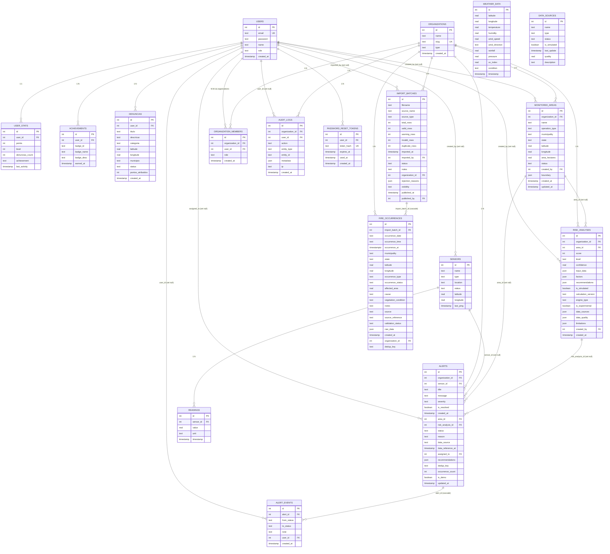

# ARTEMIS AI — Diagrama Entidade-Relacionamento (Mermaid)

```mermaid
erDiagram
  USERS ||--o{ USER_STATS : "1:1"
  USERS ||--o{ ACHIEVEMENTS : "1:N"
  USERS ||--o{ DENUNCIAS : "1:N"
  USERS ||--o{ SENSORS : "created_by (set null)"
  USERS ||--o{ MONITORED_AREAS : "created_by (set null)"
  USERS ||--o{ RISK_ANALYSES : "created_by (set null)"
  USERS ||--o{ ALERTS : "assigned_to (set null)"
  USERS ||--o{ IMPORT_BATCHES : "imported_by (set null)"
  USERS ||--o{ ORGANIZATION_MEMBERS : "N:M via organizations"
  USERS ||--o{ AUDIT_LOGS : "user_id (set null)"
  USERS ||--o{ PASSWORD_RESET_TOKENS : "1:N"
  USERS ||--o{ ALERT_EVENTS : "user_id (set null)"

  ORGANIZATIONS ||--o{ ORGANIZATION_MEMBERS : "1:N"
  ORGANIZATIONS ||--o{ MONITORED_AREAS : "1:N"
  ORGANIZATIONS ||--o{ RISK_ANALYSES : "1:N"
  ORGANIZATIONS ||--o{ ALERTS : "1:N"
  ORGANIZATIONS ||--o{ IMPORT_BATCHES : "1:N"
  ORGANIZATIONS ||--o{ FIRE_OCCURRENCES : "1:N"
  ORGANIZATIONS ||--o{ AUDIT_LOGS : "1:N"

  SENSORS ||--o{ READINGS : "1:N"
  SENSORS ||--o{ ALERTS : "sensor_id (set null)"

  MONITORED_AREAS ||--o{ RISK_ANALYSES : "area_id (set null)"
  MONITORED_AREAS ||--o{ ALERTS : "area_id (set null)"

  RISK_ANALYSES ||--o{ ALERTS : "risk_analysis_id (set null)"

  IMPORT_BATCHES ||--o{ FIRE_OCCURRENCES : "import_batch_id (cascade)"

  ALERTS ||--o{ ALERT_EVENTS : "alert_id (cascade)"

  USERS {
    int id PK
    text email UK
    text password
    text name
    text role
    timestamp created_at
  }
  ORGANIZATIONS {
    int id PK
    text name
    text slug UK
    text type
    timestamp created_at
  }
  ORGANIZATION_MEMBERS {
    int id PK
    int organization_id FK
    int user_id FK
    text role
    timestamp created_at
  }
  MONITORED_AREAS {
    int id PK
    int organization_id FK
    text name
    text operation_type
    text municipality
    text state
    real latitude
    real longitude
    real area_hectares
    text status
    int created_by FK
    json boundary
    timestamp created_at
    timestamp updated_at
  }
  RISK_ANALYSES {
    int id PK
    int organization_id FK
    int area_id FK
    int score
    text level
    real confidence
    json input_data
    json factors
    json recommendations
    boolean is_simulated
    text calculation_version
    text engine_type
    boolean is_experimental
    json data_sources
    json data_quality
    json limitations
    int created_by FK
    timestamp created_at
  }
  ALERTS {
    int id PK
    int organization_id FK
    int sensor_id FK
    text title
    text message
    text severity
    boolean is_resolved
    timestamp created_at
    int area_id FK
    int risk_analysis_id FK
    text status
    text reason
    text data_source
    timestamp data_reference_at
    int assigned_to FK
    json recommendations
    text dedup_key
    int occurrence_count
    boolean is_demo
    timestamp updated_at
  }
  ALERT_EVENTS {
    int id PK
    int alert_id FK
    text from_status
    text to_status
    text note
    int user_id FK
    timestamp created_at
  }
  AUDIT_LOGS {
    int id PK
    int organization_id FK
    int user_id FK
    text action
    text entity_type
    text entity_id
    json metadata
    text ip
    timestamp created_at
  }
  PASSWORD_RESET_TOKENS {
    int id PK
    int user_id FK
    text token_hash UK
    timestamp expires_at
    timestamp used_at
    timestamp created_at
  }
  IMPORT_BATCHES {
    int id PK
    text filename
    text source_name
    text source_type
    int total_rows
    int valid_rows
    int warning_rows
    int invalid_rows
    int duplicate_rows
    timestamp imported_at
    int imported_by FK
    text status
    text notes
    int organization_id FK
    json rejection_reasons
    text visibility
    timestamp published_at
    int published_by FK
  }
  FIRE_OCCURRENCES {
    int id PK
    int import_batch_id FK
    text occurrence_date
    text occurrence_time
    timestamptz occurrence_at
    text municipality
    text state
    real latitude
    real longitude
    text occurrence_type
    text occurrence_status
    real affected_area
    text cause
    text vegetation_condition
    text notes
    text source
    text source_reference
    text validation_status
    json raw_data
    timestamp created_at
    int organization_id FK
    text dedup_key
  }
  SENSORS {
    int id PK
    text name
    text type
    text location
    text status
    real latitude
    real longitude
    timestamp last_ping
  }
  READINGS {
    int id PK
    int sensor_id FK
    real value
    text unit
    timestamp timestamp
  }
  WEATHER_DATA {
    int id PK
    real latitude
    real longitude
    real temperature
    real humidity
    real wind_speed
    text wind_direction
    real rainfall
    real pressure
    real uv_index
    text condition
    timestamp timestamp
  }
  USER_STATS {
    int id PK
    int user_id FK
    int points
    int level
    int denuncias_count
    text achievement
    timestamp last_activity
  }
  DENUNCIAS {
    int id PK
    int user_id FK
    text titulo
    text descricao
    text categoria
    real latitude
    real longitude
    text municipio
    text status
    int pontos_atribuidos
    timestamp created_at
  }
  ACHIEVEMENTS {
    int id PK
    int user_id FK
    text badge_id
    text badge_name
    text badge_desc
    timestamp earned_at
  }
  DATA_SOURCES {
    int id PK
    text name
    text type
    text status
    boolean is_simulated
    timestamp last_update
    real quality
    text description
  }
```
